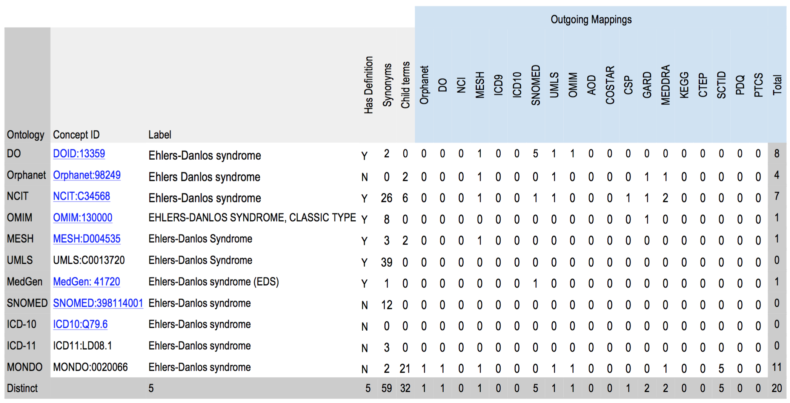

## The wild west of xrefs

In the wild, cross-references between databases (aka "xrefs") are handled very differently, if at all.
The lack of characterization about what is meant when an external identifier is invoked makes it difficult to perform cross-database joins.

For instance, take a disease such as Ehlers Danlos Syndrome. At least 11 disease terminologies have records describing this disease; however they cross reference each other in inconsistent ways.

Table 1.
Metrics for synonyms and mappings across ontology sources for pancreatic cancer and Ehlers-Danlos Syndrome.
For each, we systematically compared 11 ontologies: the Disease Ontology, Orphanet, NCIT, OMIM, MeSH, UMLS, MedGen, SNOMED, ICD10, ICD11, Mondo, and Orphanet. The ontologies differ on virtually every axis of evaluation from synonyms, to child terms, to asserted mappings.

Source data [here](https://docs.google.com/spreadsheets/d/1rVK1-c9xU-HNDdVFhtL43I36iXUi9V1WpKJTg2Hglts/edit#gid=928680550).
Interactive visualization [here](http://blockbuilder.org/jmcmurry/361baa73ad989048be54f9114f2f13c8)
